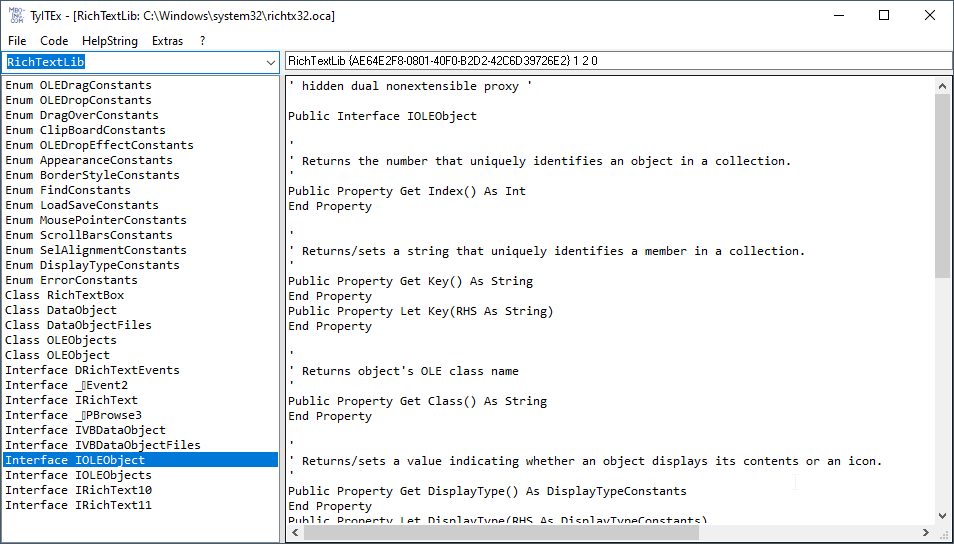

# Langg_TyTex  
## Type Library Extractor  

 
 
 
  

TyTex generates VB- or Java-code from typelibs and COM-dlls  
Project started in sept.2009.  
you need the following external modules or classes:  
* Win_Dialogs: OpenFileDialog.cls, SaveFileDialog.cls  
* Ctrl_Splitter: Splitter.cls  
* WhatsInTheVariant: MEVbVarType.bas  
* TLBINF32.dll  
  
  
